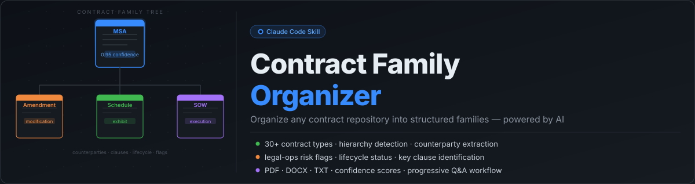

<p align="center">
  
</p>

<p align="center">
  <a href="https://github.com/nirnaypatel/contract-family-organizer-/blob/main/LICENSE"></a>
  
  
  
</p>

---

Point it at any folder of legal contracts and type `/organize-contracts`. Claude reads every file, groups them into families, maps the hierarchy, extracts counterparties and key clauses, flags legal-ops risks, and outputs a structured report — pausing to ask you about anything it's uncertain about.

Works with any contract repository. No schema, no manual tagging required.

---

## How It Works

```
/organize-contracts
```

Claude asks three questions, then handles everything else:

```
  Acme Corp MSA (2022)                      ← root / parent
  ├── Amendments
  │   ├── Amendment No. 1 — 2023.pdf        ← modification
  │   └── Amendment No. 2 — 2024.pdf
  ├── Schedules & Exhibits
  │   └── Schedule A — Pricing.pdf          ← exhibit
  ├── Statements of Work
  │   └── SOW — Project Alpha.pdf           ← execution doc
  └── Related
      └── Acme NDA 2021.pdf

  Counterparties: Acme Corp (vendor) · MyCompany Inc (client)
  Governing law: California  ·  Dispute resolution: Arbitration
  ⚠ AUTO-RENEWAL clause present — notice deadline not found
```

---

## Features

**Contract organization**
- Groups contracts into families anchored to a master/parent agreement
- Detects 9 relationship types: root, amendment, addendum, schedule, SOW, order form, renewal, superseded, related
- Recognizes 30+ agreement types across Commercial, Services, Employment, IP, Finance, Real Estate, Corporate/M&A, Regulatory, and Supply Chain

**Counterparty intelligence**
- Extracts all parties and assigns roles: vendor, client, licensor, licensee, consultant, employer, data processor, and more
- Fuzzy deduplication normalizes name variations ("Acme Corp.", "ACME CORPORATION", "Acme") to one canonical entity

**Key clause extraction**
- Auto-renewal / evergreen clauses
- Governing law and jurisdiction
- Dispute resolution (arbitration vs. litigation)
- IP ownership and work-for-hire provisions
- Indemnification scope and caps
- Limitation of liability
- Confidentiality obligations
- Termination rights and cure periods

**Legal-ops risk flags**
| Severity | Flag |
|----------|------|
| 🔴 HIGH | Contract expiring within 90 days |
| 🔴 HIGH | Amendment with no matching parent found |
| 🔴 HIGH | Uncapped indemnification |
| 🟡 MEDIUM | Auto-renewal clause (risk of inadvertent rollover) |
| 🟡 MEDIUM | Missing effective date |
| 🟡 MEDIUM | Orphan document — no family match |
| 🟢 LOW | No governing law clause |

**Lifecycle status**: active · expired · pending · superseded · terminated · unknown

**Confidence scores**: every contract gets a 0–1 score. Anything below 0.60 pauses and asks you to confirm before continuing.

---

## Installation

### On claude.ai/code (zero setup)

Clone this repo in a new session — dependencies install automatically on startup.

```
/organize-contracts
```

That's it.

### Locally (Claude Code CLI)

**1. Clone and install**

```bash
git clone https://github.com/nirnaypatel/contract-family-organizer- ~/contract-family-organizer
cd ~/contract-family-organizer
pip install -e .
```

**2. Install Tesseract** (optional — for scanned PDF OCR)

```bash
brew install tesseract          # macOS
sudo apt install tesseract-ocr  # Ubuntu / Debian
```

**3. Add the skill to Claude Code**

```bash
# For a specific project only:
mkdir -p /your/project/.claude/skills
cp ~/contract-family-organizer/.claude/skills/organize-contracts.md /your/project/.claude/skills/

# Or globally (available everywhere):
mkdir -p ~/.claude/skills
cp ~/contract-family-organizer/.claude/skills/organize-contracts.md ~/.claude/skills/
```

**4. Open Claude Code in any directory and run:**

```
/organize-contracts
```

---

## Output

The skill produces two files and optionally reorganizes your folder:

### `contract_families.json` — structured data

```json
{
  "total_families": 8,
  "families": [{
    "family_key": "ACME_CORP_MSA_2022",
    "display_name": "Acme Corp Master Services Agreement (2022)",
    "counterparties": [
      { "canonical_name": "Acme Corp", "role": "vendor", "aliases": ["ACME CORPORATION"] }
    ],
    "hierarchy": {
      "root":       { "filename": "Acme_MSA_2022.pdf",      "confidence": 0.95, "lifecycle_status": "active" },
      "amendments": [{ "filename": "Amendment_1_2023.pdf",   "confidence": 0.88 }],
      "schedules":  [{ "filename": "Schedule_A_Pricing.pdf", "confidence": 0.91 }],
      "sows":       [{ "filename": "SOW_ProjectAlpha.pdf",   "confidence": 0.87 }]
    },
    "legal_ops_flags": [
      { "flag": "auto_renewal_risk", "severity": "MEDIUM", "detail": "Auto-renewal clause found; notice deadline unknown" }
    ]
  }],
  "review_needed": [],
  "unclassified": []
}
```

### `report.md` — human-readable report

- Legal-ops flags table sorted by severity
- ASCII hierarchy tree per family
- Counterparty table with roles
- Key dates: effective, expiration, auto-renewal notice deadlines
- Documents needing review with uncertainty reasons

### Folder reorganization (optional)

```
output/
  ACME_CORP_MSA_2022/
    root/         amendments/   schedules/
    addendums/    sows/         order_forms/    review_needed/
  BETA_LLC_NDA_2021/
    root/
  _unclassified/
```

Choose copy (keep originals) or move at runtime. Always shows a dry-run preview before touching files.

---

## Supported File Types

| Format | Extraction |
|--------|-----------|
| `.pdf` | `pypdf` for digital; `pytesseract` OCR fallback for scanned |
| `.docx` / `.doc` | `python-docx` |
| `.txt` / `.md` | Direct read |

Extraction results are cached by SHA-256 hash — re-running on the same folder is instant.

---

## Requirements

- Python 3.11+
- Claude Code (CLI, claude.ai/code, or IDE extension)
- Tesseract — optional, for scanned PDF support

---

## License

MIT
